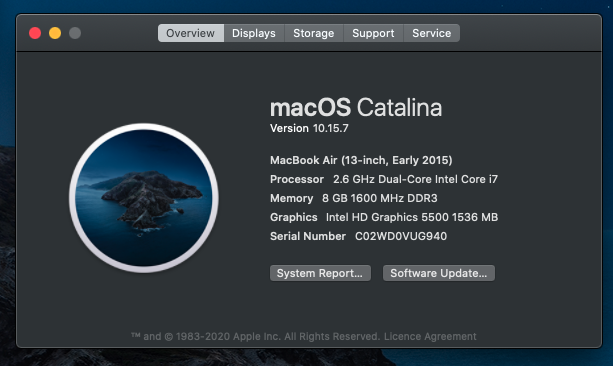

**This is my Quackintosh boot config quackup for my ThinkPad using OpenCore, This is NOT what I used for creating my USB boot drive.**

Currently I installed Cataline just cause of the abundance of documentation and support forums... But I will update to Big Sur soon, hopefully

## What works.
    - Trackpad works flawlessly. I've used 1.2 version of VoodooRMI
    - Wifi Works, Kinda. sometimes it'll take up a lot of time to search for nearby network ssids, will look into this later...
    - External audio interface connected. I am using this until i figure out the builtin Headphone noise problem.

## What does not work.
    - Builtin Headphone jack has a static noise. ( I think Mostly because of alcid mismatched with the onboard chip.)
    - No Big issues.  
    Note: I haven't extensively tested anything yet. I just want to get a basic env going so that I can work on it.

# About
My Thinkpad is a X1 carbon 2015 model, AKA X1C3, AKA ThinkPad X1 Carbon Gen3 2015 Model, everything is stock, no modifications, (I changed the hinges once, but I don't think that counts as modification...)

